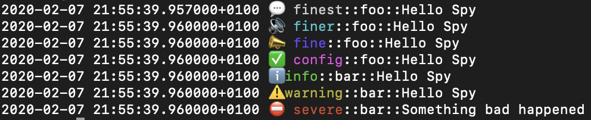

[](https://travis-ci.org/appunite/Spy)
[](https://codecov.io/gh/appunite/Spy)
[](https://github.com/Carthage/Carthage)
[](https://cocoapods.org/pods/Spy)
[](https://cocoapods.org/pods/Spy)
[](#)
[](https://cocoapods.org/pods/Spy)


Spy is a flexible, lightweight, multiplatform logging utility written in pure Swift. It allows to log on different levels and channels which you can define on your own depending on your needs.

## Requirements

### Development
Project uses following tools for development
1. [XCodeGen](https://github.com/yonaskolb/XcodeGen)
2. [Cocoapods](https://cocoapods.org)
3. [SwiftLint](https://github.com/realm/SwiftLint)
4. [Sourcery](https://github.com/krzysztofzablocki/Sourcery)

## Installation

To get started with the **Spy** you first have to decide how you will integrate it with your project. Spy supports following tools:

### Cocoapods

To install Spy using Cocoapods go through following steps:

1. Add the following entry in your **Podfile**:
```
pod 'Spy'
```
2. Then run `pod install`.


### Carthage

To install Spy using Carthage go through following steps:

1. Add the following entry to your **Cartfile**

```
github "appunite/Spy"
```

2. Then run ```carthage update```

### Swift Package Manager

To install Spy using **Swift Package Manager** go through following steps:

1. Add following package dependency in you **Package.swift** ``` .package(url: "https://github.com/appunite/Spy.git", from: "0.3.1") ```
2. Add following target dependency in your **Package.swift** ``` dependencies: ["Spy"]) ```

For instance this is how it might look like:
```swift
import PackageDescription

let package = Package(
    name: "YourLibrary",
    products: [
        .library(
            name: "YourLibrary",
            targets: ["YourLibrary"])
    ],
    dependencies: [
        .package(url: "https://github.com/appunite/Spy.git", from: "0.3.1")
    ],
    targets: [
        .target(
            name: "YourLibrary",
            dependencies: ["Spy"])
    ]
)
```

## Overview

Here is a quick overview of functionalities and concepts used in **Spy**.

### SpyChannel

SpyChannel is anything that implements *PSpyChannel* protocol. Channels can be used to categorize logs. Typically they are implemented with an enum. You can define your own channels as follows:
```swift
public enum SpyChannel: String, PSpyChannel {
    case foo
    case bar
    
    public var channelName: String {
        return self.rawValue
    }
}
```

### SpyLevel
SpyLevel is anything that implements *PSpyLevel* protocol. You can define your own levels, but Spy commes with one set defined for you so you can use it if you want. This set is called *SpyLevel* and contains following alert levels: *finest, finer, fine, config, info, warning, severe* sorted by the increasing alert priority.

### SpyConfiguration
Contains levels and channels that the Spy will spy on.

### SpyConfigurationBuilder
Builds your spy configuration by providing add and remove functions for both levels and channels.
Example usage:
```swift
SpyConfigurationBuilder()
    .add(level: .severe)
    .add(channels: [.foo, .bar])
    .build()
```

### Spyable
Spyable is a entity that can be logged. It has to implement *PSpyable* protocol. You can define your own spyables or use string as a basic one.

### Spy
Spy is anything that implements *PSpy* protocol. There are a few spies already defined for you:
- *ConsoleSpy* - spy that logs spyables by using print command
- *CompositeSpy* - spy that groups multiple spies into one
- *AnySpy* - type-erased spy - every spy can be converted to AnySpy

Logging is performed with **log** method as follows:
```swift
spy.log(level: .severe, channel: .foo, message: "Something bad happened")
```

#### ConsoleSpy
ConsoleSpy comes with two available output formatters **RawSpyFormatter** and **DecoratedSpyFormatter** with the later being extendable with decorators. You can always define your own output formatter.
Example output for *RawSpyFormatter* will look like:
```
info::foo::Hello Spy
```
And example output for *DecoratedSpyFormatter* may look like:
```
ℹ️ info::foo::Hello Spy
```
<p align="center">
  
</p>

## Example
This is an example definition of the spies.
It utilizes *CompositeSpy* to allow you to log onto multiple destinations (*Console* and *Network*). Please note that *ConsoleSpy* is shipped with the *Spy* and *NetworkSpy* is not.
```swift
public struct Environment {
    public static var spy: AnySpy<SpyLevel, SpyChannel> = {
        return CompositeSpy()
            .add(spy: ConsoleSpy<SpyLevel, SpyChannel, DecoratedSpyFormatter>(
                spyFormatter: DecoratedSpyFormatter(
                    levelNameBuilder: DecoratedLevelNameBuilder<SpyLevel>()
                        .add(decorator: EmojiPrefixedSpyLevelNameDecorator().any())
                        ),
                timestampProvider: CurrentTimestampProvider(),
                configuration: SpyConfigurationBuilder()
                    .add(levels: SpyLevel.levelsFrom(loggingLevel))
                    .add(channel: .foo)
                .build()).any())
            .add(spy: NetworkSpy()
                .apply(configuration: SpyConfigurationBuilder()
                    .add(level: .severe)
                    .add(channels: [.foo, .bar])
                    .build()).any()
        ).any()
    }()
}
```
By using preprocessor we can define different logging levels for debug and release. That way we won't forget about switching off unimportant logs before release.
```swift    
public extension Environment {
	static var loggingLevel: SpyLevel {
        #if DEBUG
        return .info
        #else
        return .warning
        #endif
    }
}
```

And here is how you could use Spy:
```swift
Environment.spy.log(level: .info, channel: .foo, message: "Hello Spy")
```

For more detailed example please see the source code.

## Contribution

Project is created and maintained by **Tomasz Lewandowski**.

If you created some new feature or fixed a bug you can create a pull request. Please feel free to submit your feature requests if you have any.

## License

Spy is released under an MIT license. See [License.md](LICENSE.md) for more information.
